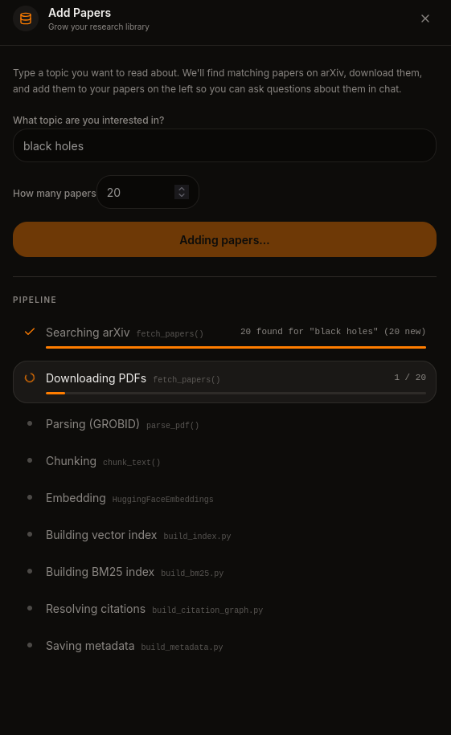
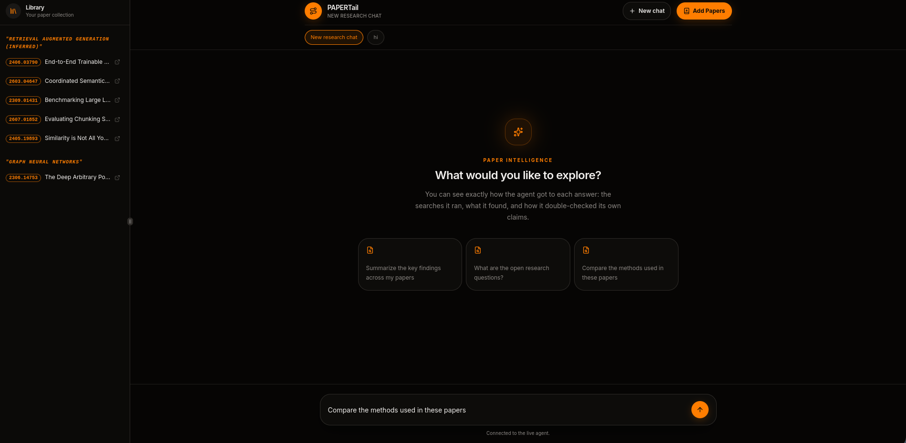
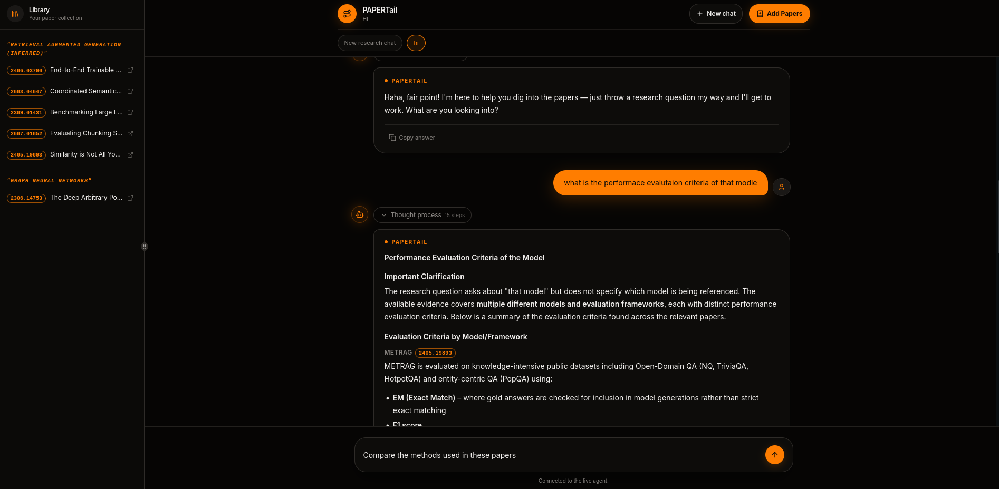
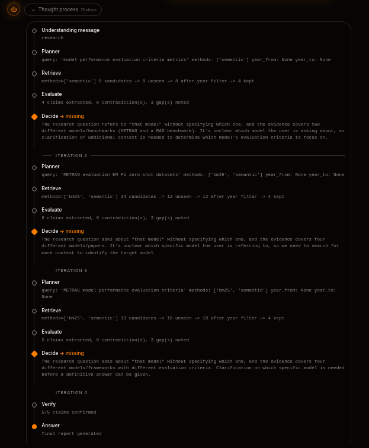
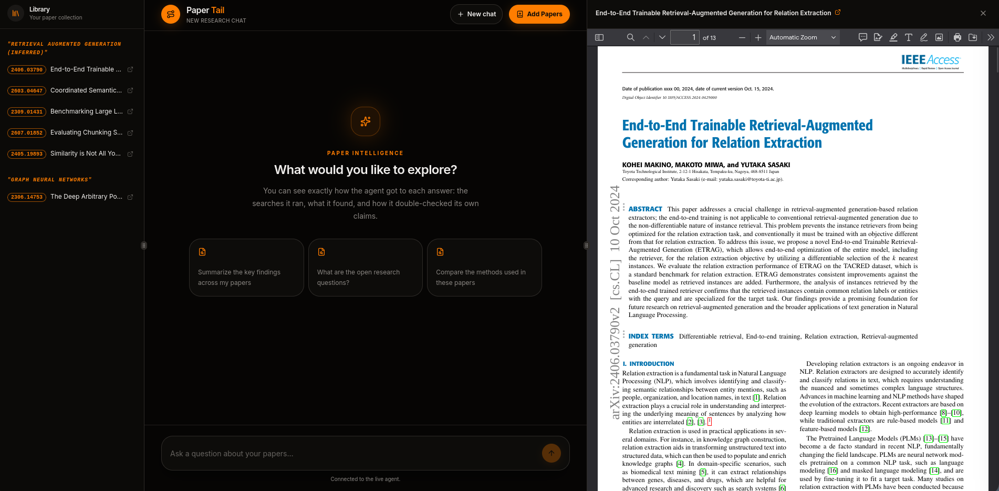
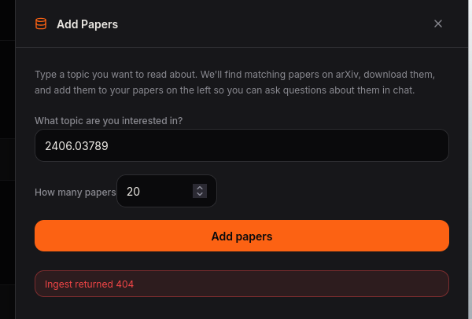

# Paper Tail

An agentic RAG system that researches scientific papers — not one-shot
top-K retrieval. The agent plans searches, picks retrieval methods per
question (semantic / keyword / metadata filter), evaluates evidence,
detects contradictions between papers, follows a paper's citations when it
needs more context, verifies every claim against real evidence before
writing an answer, and can grow its own paper library from a topic you
type in.

See `architecture-diagram.html` for the full runtime-loop and ingestion
diagrams, and `FRONTEND_UI_DESIGN.md` for the UI spec.

## What's here

- **`backend/`** — FastAPI + LangGraph agent, Python (`uv`-managed)
- **`frontend/`** — React + Vite + TanStack Start chat UI

## Prerequisites

| Tool | Used for | Check |
|---|---|---|
| [uv](https://docs.astral.sh/uv/) | Python package/venv manager for the backend | `uv --version` |
| Python 3.11+ | backend runtime (uv will use/install this) | — |
| Node.js + npm | frontend dev server | `node --version` |
| Docker | runs GROBID (real PDF structure parsing) | `docker --version` |

## API keys you need

| Key | Required? | Get it from | Why |
|---|---|---|---|
| `GROQ_API_KEY` | **Yes** | [console.groq.com](https://console.groq.com) (free tier) | Every LLM call in the agent — planning, evaluating, deciding, writing answers |
| `OPENALEX_EMAIL` | No, but recommended | your own email | Joins OpenAlex's "polite pool" for citation resolution, higher anonymous rate limit |
| `OPENALEX_API_KEY` | No | [openalex.org](https://openalex.org) | Without it, citation resolution is capped at ~100 requests/day (a hard quota, not a retryable throttle) — a real key raises this to 10,000/day |

Nothing else needs a key — arXiv's API is free/keyless, and embeddings
run locally (BAAI/bge-m3, downloaded once by Hugging Face on first use).

## 1. Start GROBID (PDF parsing)

Required before ingesting any paper — the backend calls it to parse PDF
structure (sections, references), not a bundled library.

```bash
docker run -d --name grobid -p 8070:8070 grobid/grobid:0.8.1
```

Check it's actually up (the model takes 30-90s to finish loading after the
container starts):

```bash
curl http://localhost:8070/api/isalive
```

If you restart your machine, the container won't auto-resume — check
`docker ps -a --filter name=grobid` and `docker start grobid`.

## 2. Backend setup

```bash
cd backend
uv sync
```

Create `backend/.env`:

```
GROQ_API_KEY=your-key-here
OPENALEX_EMAIL=your-email-here
OPENALEX_API_KEY=your-key-here
```

(`OPENALEX_EMAIL`/`OPENALEX_API_KEY` can be left blank to start — you'll
just hit OpenAlex's low anonymous rate limit sooner when resolving
citations for a large batch of papers.)

Run the backend:

```bash
uv run uvicorn app.main:app --port 8020
```

Confirm it's up: `curl http://localhost:8020/health` → `{"status":"ok"}`

## 3. Frontend setup

```bash
cd frontend
npm install
```

Create `frontend/.env`:

```
VITE_AGENT_API_URL=http://localhost:8020
```

Run it:

```bash
npm run dev
```

Open the URL it prints (defaults to `http://localhost:8080`). Without
`VITE_AGENT_API_URL` set, the UI still loads and runs in a self-contained
**demo mode** with scripted fake data — useful for reviewing the interface
without a backend running, but it's not talking to your real papers.

## Using it

1. **Add Papers** (top-right button) — type a topic (e.g. "quantum
   computing", not a full sentence — arXiv's search does literal keyword
   matching, so the app strips filler words automatically but a real topic
   still helps) and how many papers to fetch. Watch it search arXiv,
   download, parse, chunk, embed, index, and resolve citations live.
2. **Chat** — ask a question about your papers. Click "Thought process"
   above any answer to see the real step-by-step agent trace: what it
   searched, what it found, whether it checked a paper's citations, how it
   verified its own claims.
3. **Sidebar** — papers are grouped by the keyword search that found them.
   Click any paper to open its real PDF in the right-hand panel.

## Screenshots

**Add Papers** — type a topic, watch the real ingestion pipeline run live:




**Chat** — every answer comes with the real agent trace, not just the final text:





**PDF panel** — click any paper (in the sidebar or a citation pill) to read its real PDF alongside the chat:



**Errors surface honestly, not silently** — e.g. hitting an endpoint before it existed yet during development:



## Troubleshooting

- **A backend code change doesn't seem to take effect** — Python doesn't
  hot-reload; stop the `uvicorn` process (Ctrl+C) and start it again.
- **A `.env` change doesn't seem to take effect (frontend)** — Vite only
  reads `.env` at startup, not via hot-reload; restart `npm run dev`.
- **GROBID connection errors during Add Papers** — check
  `docker ps --filter name=grobid` shows it `Up`, and that
  `curl http://localhost:8070/api/isalive` succeeds.
- **Citation resolution stalls or a build seems to hang** — OpenAlex's
  anonymous tier is a real ~100/day quota, not a per-minute throttle; it
  resets after ~24h regardless of retries. Add a real `OPENALEX_API_KEY`
  to raise it to 10,000/day.
